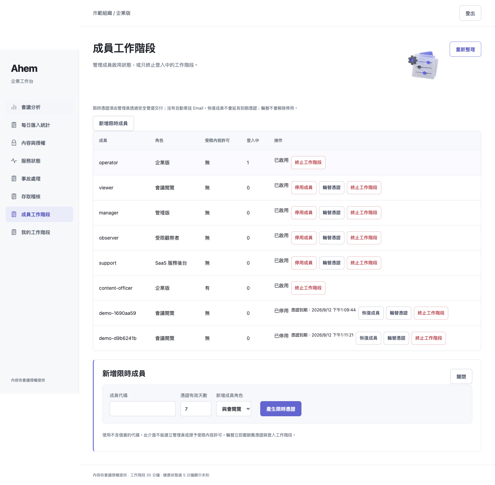
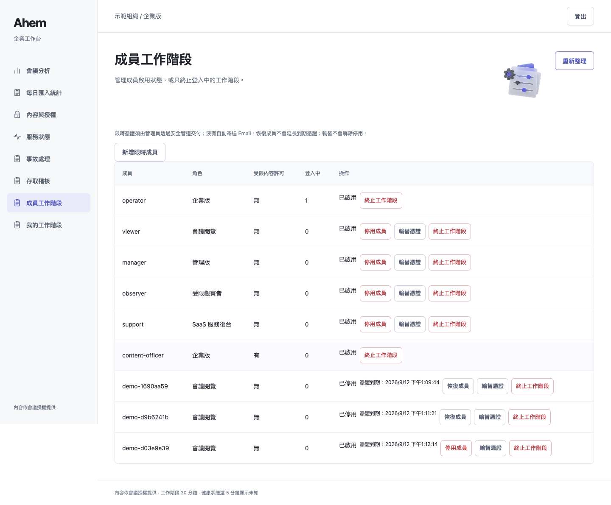
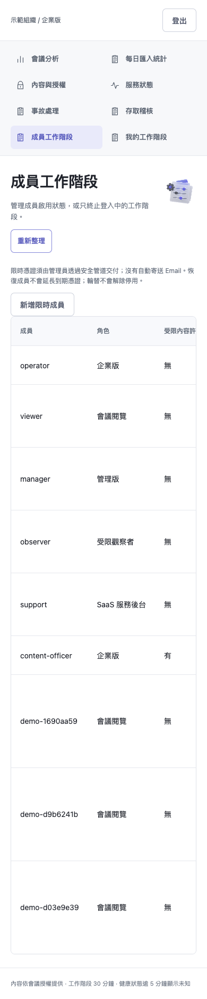

# 限時成員與憑證輪替：本次交付證據

## 本輪完成

- 管理員新增同組織的限時成員：Viewer、Manager、Observer、Support；有效期 1–30 天。成員代碼限小寫英數／底線／連字號，不使用 Email 或姓名。
- 管理員對其他可管理成員輪替憑證，撤銷所有舊登入。新憑證只回傳一次，UI 預設密碼遮罩，關閉／兩分鐘後清除。資料庫僅保存雜湊。
- 資料庫憑證覆蓋舊靜態憑證，重啟後旧憑證不會復活。到期、停用、輪替是不同狀態：恢復不延長期限；輪替不解除停用。
- 不能透過新增成員頁建立 Operator 或提高受限內容許可。跨組織操作與自己輪替皆拒絕。
- API：`POST /api/members/create`、`POST /api/members/rotate`，沿用 session、Origin、role、tenant 邊界。

**這是管理員私下交付的限時存取憑證，不是 Email 邀請、單次兌換連結或 SSO。** 在到期／停用／輪替前，可重複用此憑證登入。
回應遺失時不能查回明文，必須再輪替。請勿把產生憑證的網路回應錄入日誌、trace 或公開截圖。

## 本次實測

| 項目 | 實際結果／證據 |
|---|---|
| 完整 suite | 675 passed、21 skipped、2 xfailed、0 failed，28.23 秒，exit 0；[pytest.log](pytest.log) |
| 新增後台與既有後台子集 | 62 passed，exit 0 |
| 六角色回歸 | 六角色 pass，零 page/console errors；[roles.log](roles.log) |
| 新增 UI 流程 | 建立 → 新憑證登入 → 輪替 → 舊憑證與舊 session 拒絕 → 新憑證登入 → 停用拒絕；[browser.log](browser.log) |
| 畫面 | Chrome 1440×1000、390×844；正常標題、非空白、無錯誤畫面／JS 錯誤、無水平溢出 |

環境：macOS／Python 3.13.5，Playwright 使用已安裝 Google Chrome。Browser skill 未提供，依 frontend-testing-debugging 使用 Playwright。
最初 sandbox 禁止 bind loopback，出現 PermissionError，未執行功能斷言；改用獲准的本機測試執行後完整重跑。沒有加入安全繞過。
瀏覽器檢查另發現 Chrome HTML pattern 的 v-mode 不接受未跳脫連字號，已改成明確選項表示式，重新測試零 console errors。UI 登入測試應用獨立程序，避免與六角色回歸合計觸發既有登入限流；沒有取消限流。
21 skips 仍為 17 私有 holdout 缺少與 4 真實 Discord opt-in；2 xfail 為既有項目。

```sh
# 本次完整測試（browser_channel 僅指定本機 Chrome）
PYTHONPATH=src:../outputs/enterprise-ui-20260905 ../ahem/.venv/bin/python -m pytest -p browser_channel -q -rs tests
# 在其他已安裝 Playwright Chromium 的環境不需要本機 adapter：
python -m pytest -q -rs tests
python -m pytest -q tests/test_enterprise_credentials.py
python scripts/verify_enterprise_credentials.py --identities PRIVATE_SYNTHETIC_IDENTITIES --url http://127.0.0.1:8895 --output SCREENSHOT_DIRECTORY
```

UI 腳本只適用合成 demo：會建立一個測試成員，驗證後停用；不輸出明文 token，不在憑證 DOM 存在時截图。

## 部署與復原限制

- 新增 `member_credentials` 表。啟動時資料庫 profile／digest 優先於同 id 的 bootstrap 身分檔；它不是外部 IdP 同步。
- 不要直接用舊版程式 rollback：舊版忽略輪替／停用表，可能讓舊憑證恢復。須先重新核對所有有效身分及撤權記錄。
- 舊備份可能帶回舊憑證雜湊與授權；還原切換前須核對輪替、停用、到期及逐場 grant。
- 目前單程序、上限 1000 身分；列表仍非大規模目錄管理，不支援多 worker 憑證同步。
- 新成員角色與管理權限固定，角色變更／刪除及 Email 自助註冊尚未實作。

## 整體還沒完成的項目

1. Email 邀請／安全兌換流程；目前僅人工交付限時憑證。
2. SSO／MFA：需選定身分供應商、應用註冊、回呼網址與測試帳號，尚未整合。
3. 真實會議日期的長期效率分析；目前只提供匯入日期統計，不能當作效率評分。
4. KMS 輪替、legal hold、備份自動到期清除與正式災難切換；已有的只是本機加密備份及新檔還原驗證。
5. 真實服務監測、自動事故與通知投遞／值班：需選定訊號來源、通知管道及接收對象，尚未整合。
6. Raspberry Pi/aarch64 實機、容量與音訊延遲壓測；產業合規认证。

本輪公開內容僅合成 demo 截圖、程式與測試證據，不包含私有身分檔、KEK 或產生的新憑證。上傳獨立分支，不建立 PR，不合併 main。

## 運行截圖




