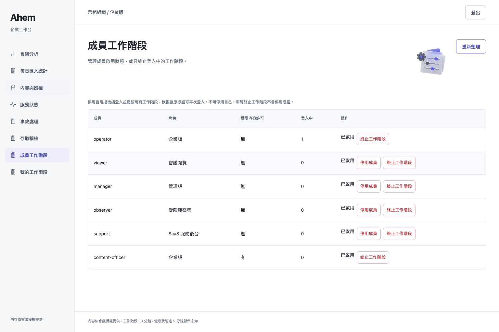
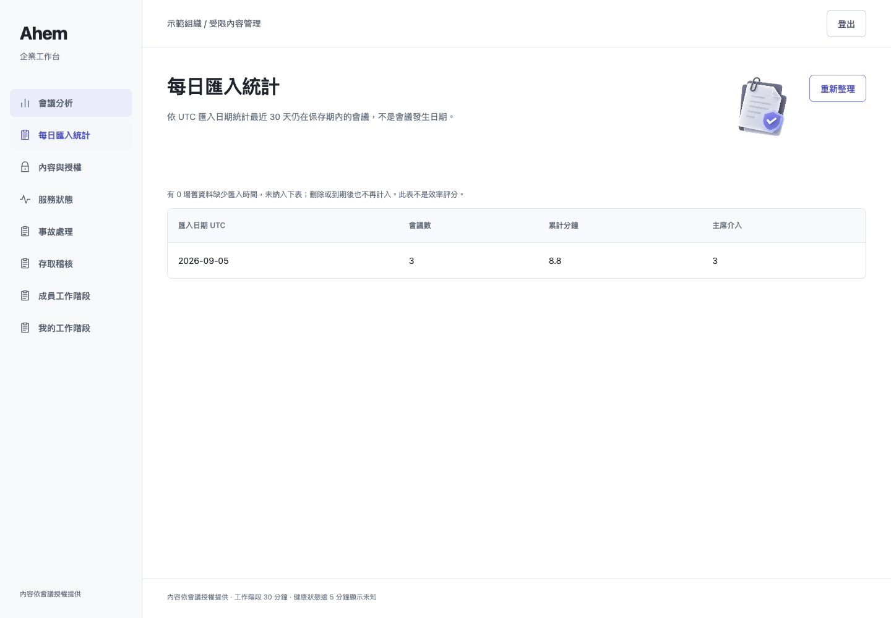
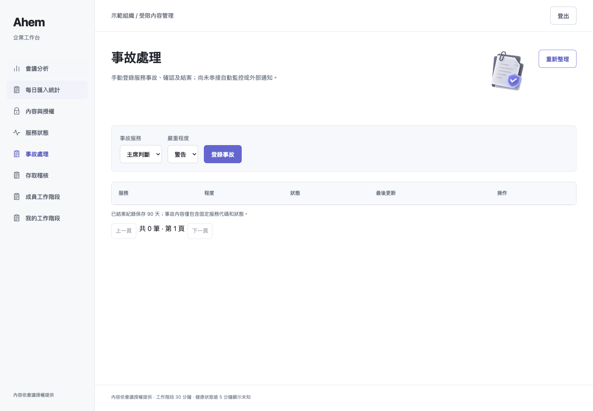
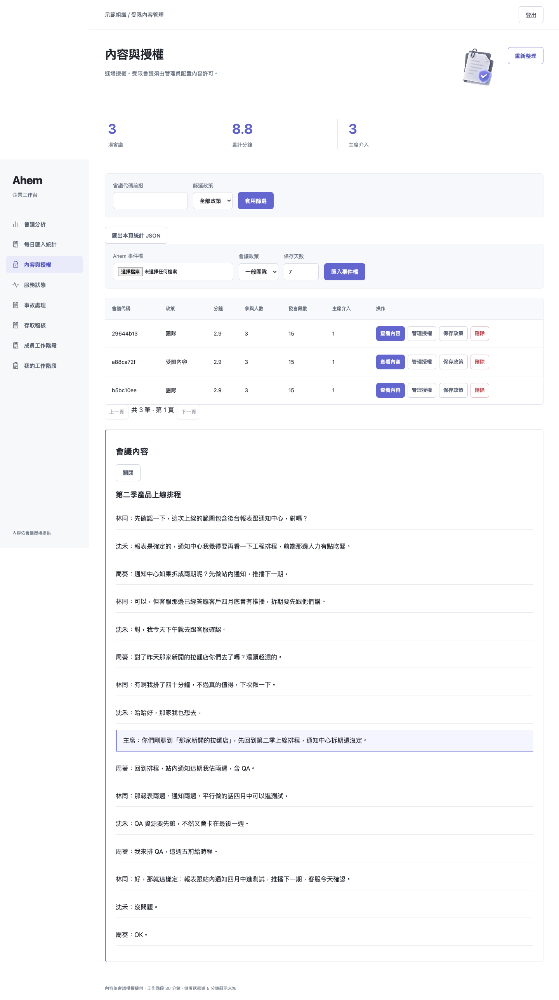
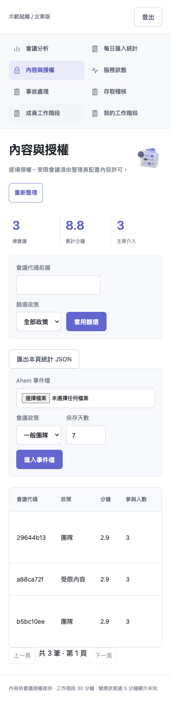

# 本機企業版增量與實際驗證

本輪新增加密備份 CLI、驗證與還原測試；同時包含前輪尚未推送的每日統計、成員停用／恢復、事故處理 UI。
所有截圖來自本機 Chrome 操作公開合成會議，不含登入憑證。沒有建立 PR／合併 main。

## 結果

| 檢查 | 本次實際結果 |
|---|---|
| 完整 pytest | 665 passed / 21 skipped / 2 xfailed / 0 failed，exit 0，28.21 秒 |
| 六角色瀏覽器 | 全部通過，page/console errors = 0，exit 0 |
| 加密備份 → 驗證 → 新檔還原 | 三個命令均 exit 0，完整性及 3 筆加密會議驗證成功 |
| 還原後服務 UI | 獨立 8894 啟動；登入、每日統計、事故頁、受限內容解密通過 |
| 防覆寫、錯誤金鑰、檔案權限 | `tests/test_enterprise_backup.py` 實測 |

環境：macOS、Python 3.13.5、Playwright + 本機 Chrome；Browser skill 不可用。
21 skips：17 私有 holdout 缺少、4 真實 Discord opt-in。2 xfail 為既有項目，不能當作通過測試。
完整 log：[pytest.log](pytest.log)、[browser.log](browser.log)、[restore-ui.log](restore-ui.log)。

首次新增備份測試發現解密呼叫缺少明確用途參數，修正為本機管理員的備份完整性驗證用途後，全套重跑通過。
這是持有 KEK 的本機管理 CLI，不是讓 Viewer 或網路 API 取得受限資料的捷徑。

## 重現

在安裝專案 requirements 與 Playwright browser 的環境：

```sh
python -m pytest -q -rs tests
python -m pytest -q tests/test_enterprise_backup.py
python scripts/verify_enterprise_browser.py --identities PRIVATE_IDENTITIES_JSON --url http://127.0.0.1:8891 --channel chrome --output PRIVATE_SCREENSHOT_DIRECTORY
```

本機完整測試實際使用 `PYTHONPATH=src:../outputs/enterprise-ui-20260905 ../ahem/.venv/bin/python -m pytest -p browser_channel -q -rs tests`。
repo 外 browser_channel adapter 僅讓 pytest 使用已安裝 Chrome；不跳過安全測試。其他機器安裝標準 Chromium 後不需要此 adapter。

備份操作請由管理員在 repo 根目錄執行，先準備私有 0700 目錄及 32-byte KEK 的既有設定：

```sh
export PYTHONPATH=src
export AHEM_KEK_FILE=/absolute/private/kek
python -m meeting_host.enterprise_backup backup --source /absolute/private/enterprise.db --destination /absolute/private/new-snapshot.enc
python -m meeting_host.enterprise_backup verify --source /absolute/private/new-snapshot.enc
python -m meeting_host.enterprise_backup restore --source /absolute/private/new-snapshot.enc --destination /absolute/private/new-restored.db
# 以獨立 port 啟動還原 DB，不覆蓋現行部署；使用既有相容的私有 identities 與 KEK。
python scripts/verify_enterprise_restore.py --identities PRIVATE_IDENTITIES_JSON --url http://127.0.0.1:8894/ --output PRIVATE_SCREENSHOT_DIRECTORY
```

snapshot 全檔 AES-GCM 加密（含統計與授權中繼資料），寫出 0600；verify／restore 會驗 SQLite 完整性及每筆會議解密。
資料庫上限 64 MiB，採記憶體 snapshot，尚未做大資料量壓測。備份不包含 KEK 或私有身分檔，必須分開保管。
restore 只接受不存在的輸出檔，不取代現行 DB；**沒有自動部署切換或網頁還原按鈕**。
還原旧備份也會回復旧授權／停用狀態，正式切換前必須重套後續撤權／停用並核對保存期限。
備份檔本身尚無自動到期清理，因此會議保存政策不等於備份已刪除；由管理員另行管理備份期限。

## 已完成與未完成

| 層級 | 現在可操作 | 仍未完成 |
|---|---|---|
| 2 | 統計、分頁篩選、匯出、每日匯入統計 | 真實會議日期的長期趨勢、效率評分與匿名性評估 |
| 3 | 授權、稽核、session 管理、持久成員停用／恢復 | 成員邀請、憑證輪替 UI、SSO／MFA |
| 4 | 受限許可、用途、加密內容、保存期；新增本機加密備份／新檔還原演練 | KMS 輪替、legal hold、備份自動保留、正式災難切換、合規認證 |
| 5 | 健康歷程、未知提示、手動事故確認／結案 | 真實監測 adapter、自動事故與外部通知、值班排程 |

SSO／MFA 下一步需選擇身分供應商、回呼網域與測試帳號；通知需決定管道與接收對象；KMS 需指定金鑰服務與權限。
本次未進行真實 Discord／Azure／ElevenLabs 端到端、Linux/aarch64 實機、高併發或音訊延遲驗證。

## 真實執行畫面






