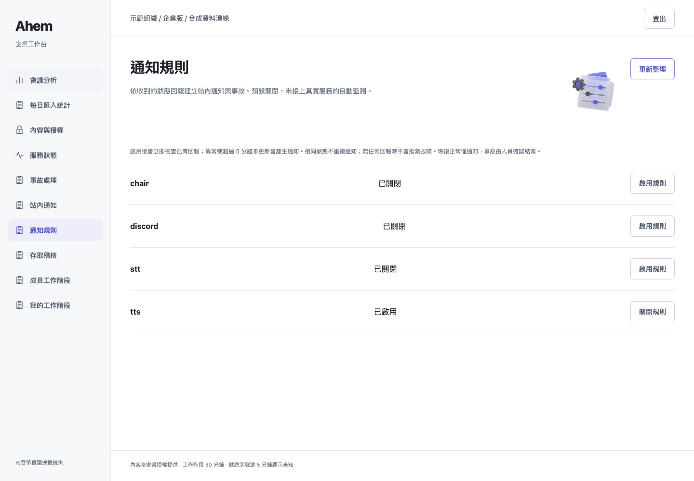
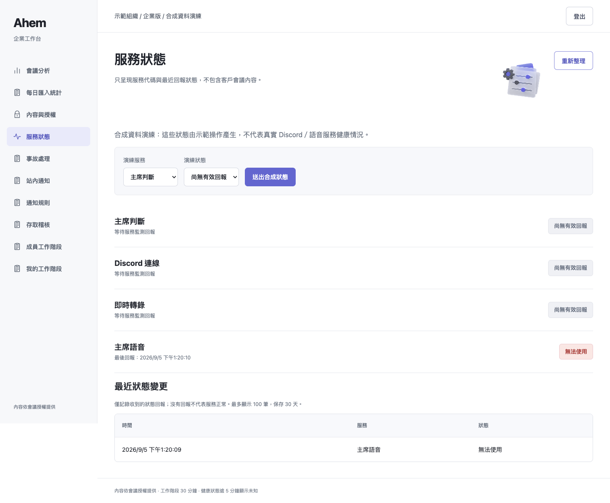
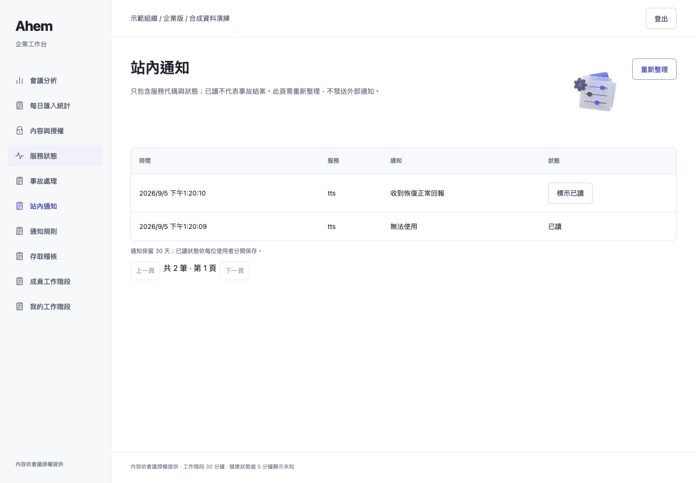
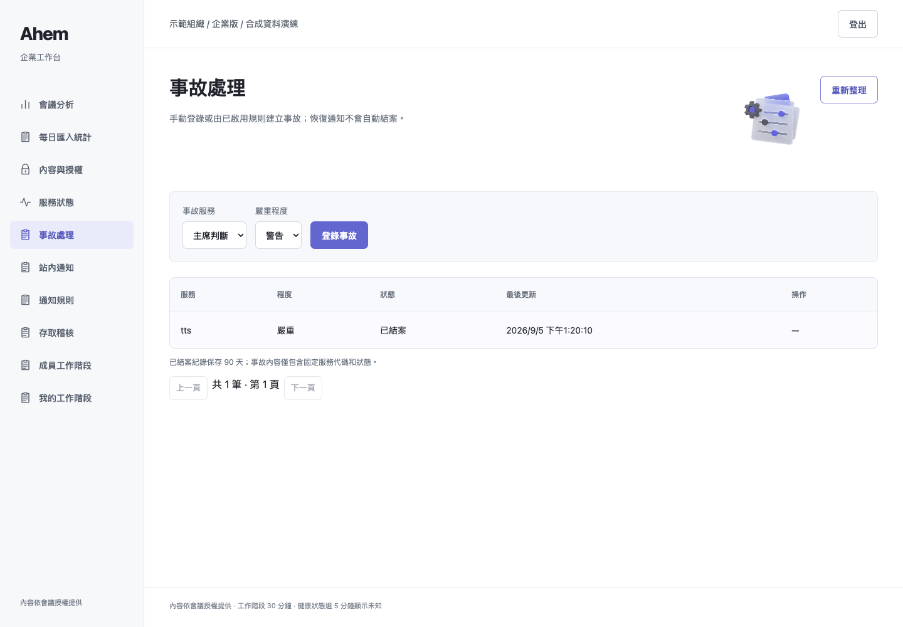
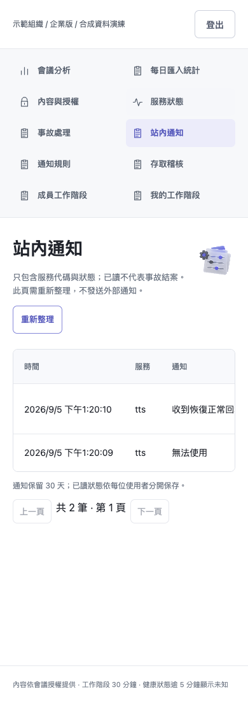

# 本機 demo：站內通知、自動事故與可操作演練

## 本次範圍

使用者已明確選擇「暫不接外部服務，只完成本機 demo」。因此本次不接 SSO、Email、外部 KMS 或真實監測；不以模擬畫面宣稱外部服務完成。
本輪在前次已完成的權限、限時成員、憑證輪替、匯入統計與加密備份基礎上，補完下列演練流程。

## 已完成

- 管理員按服務啟用／關閉規則，預設關閉。啟用時立即評估已有回報。
- degraded / unavailable / unknown 產生站內通知及事故；同狀態不重複通知，同服務不重複開啟未結案事故，升為 unavailable 時提高事故嚴重度。
- 收到 ok 回報產生恢復通知，但不擅自結案。人工確認事故、處理、結案仍分開。
- 已讀狀態逐人保存，不能替其他人標已讀；按 tenant 隔離，客服不能修改規則。
- 曾有回報但超過 5 分鐘未更新，定時清理工作將其評估為 unknown；正常排程約 5–6 分鐘內評估，並非硬即時保證。從未收到回報不推測故障。
- 通知保留 30 天並分頁；事件只包含固定服務代碼與狀態，不帶原始錯誤／逐字稿。
- `--demo-mode` 顯示合成狀態回報操作，及醒目的「合成資料演練」提示。此旗標只開啟演練 UI，不跳過登入／角色／Origin 等安全檢查。

API：`GET/POST /api/alert-rules`、`GET /api/notifications`、`POST /api/notifications/{id}/read`，以及既有 `POST /api/health`。
新增表：alert_rules、alert_state、notifications、notification_reads；不改寫既有會議密文。

## 本次實際驗證

| 項目 | 結果 |
|---|---|
| 完整 suite | **682 passed / 21 skipped / 2 xfailed / 0 failed，exit 0，28.42 秒** |
| 通知＋事故子集 | 15 passed，exit 0 |
| 六角色 UI 回歸 | 全部通過，零 page/console errors |
| 新增操作迴圈 | 啟用 tts → 合成不可用回報兩次 → 僅一通知／事故 → 標已讀 → 合成正常回報 → 恢復通知 → 人工結案 → 客服仍各自未讀 |
| 桌機／手機 | Chrome 1440×1000、390×844；標題正確、非空白、無錯誤覆蓋畫面、無水平溢出／JS 錯誤 |

環境為 macOS、Python 3.13.5、Playwright + 已安裝 Chrome。Browser skill 未提供，依前端測試技能使用現有 Playwright；本機伺服器測試使用獲准的 loopback 執行。
21 skips 仍為 17 私有 holdout 缺少、4 真實 Discord opt-in；2 xfail 為既有項目。
證據：[pytest.log](pytest.log)、[roles.log](roles.log)、[browser.log](browser.log)、`tests/test_enterprise_alerts.py`。

```sh
# 本次完整測試使用 repo 外 Chrome adapter，不改安全邏輯
PYTHONPATH=src:../outputs/enterprise-ui-20260905 ../ahem/.venv/bin/python -m pytest -p browser_channel -q -rs tests
# 一般安裝好 Playwright Chromium 的環境
python -m pytest -q -rs tests
python -m pytest -q tests/test_enterprise_alerts.py
# 新建合成 demo，以 --demo-mode 顯示演練控制（不要用真實會議）
PYTHONPATH=src python scripts/enterprise_local_demo.py --directory /absolute/new/private-demo
PYTHONPATH=src AHEM_KEK_FILE=/absolute/new/private-demo/kek python -m meeting_host.enterprise --identities /absolute/new/private-demo/identities.json --database /absolute/new/private-demo/enterprise.db --port 8897 --demo-mode
python scripts/verify_local_alert_demo.py --identities /absolute/new/private-demo/identities.json --url http://127.0.0.1:8897 --output SCREENSHOTS
```

UI 驗證腳本要求規則初始關閉、無既有 tts 事故的新合成 workspace；不可對真實部署執行。它會改變規則、健康回報、事故與已讀狀態，不是唯讀檢查。

## 五分鐘展示順序

1. operator 登入 →「通知規則」→ 啟用 tts。
2.「服務狀態」→ 演練服務「主席語音」→ 演練狀態「無法使用」→ 送出合成狀態。
3.「站內通知」→ 查看通知並標已讀；「事故處理」→ 查看自動事故。
4. 回服務狀態送出「正常」→ 通知頁出現恢復回報，事故仍需人工確認／結案。
5. support 登入 → 可看通知與事故，不能改通知規則，也看不到會議內容。

## 本機 demo 的限制與範圍外項目

- 已完成本輪站內流程；通知頁需按重新整理，沒有 OS 推播、Email 或背景瀏覽器通知。
- 服務回報由合成演練或授權 API 提交，未串真實 Discord／STT／TTS 監測。
- 規則停用再啟用會重新評估並可能再次通知；手動結案後相同未變狀態不會立即重開。
- 尚未做長時間耐久、併發／容量、Raspberry Pi 或音訊延遲壓測，不以功能測試替代效能證據。
- 外部 SSO／MFA、Email 邀請、外部通知、KMS 輪替、legal hold、正式災難切換與合規認證：依最新選擇不在本次 demo 範圍。
- 長期效率分析、備份自動清理也不是本次演練能力；既有匯入統計／手動加密備份不可混稱完整商用分析／備份平台。

上傳內容限合成畫面、程式與測試紀錄；無憑證、KEK、私有 DB。只更新獨立分支，不建立 PR，不合併 main。

## 實際運行截圖






