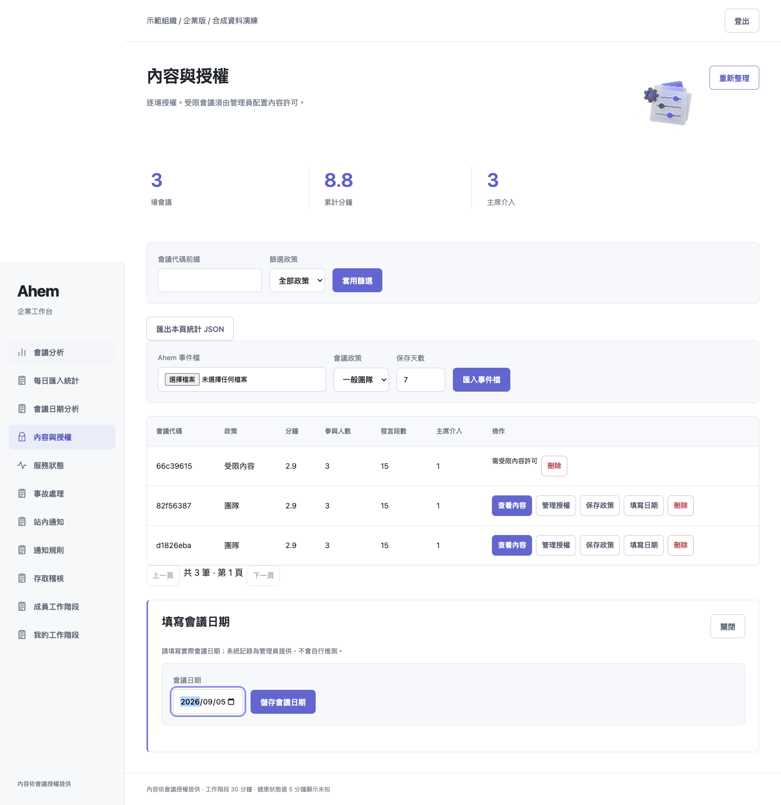
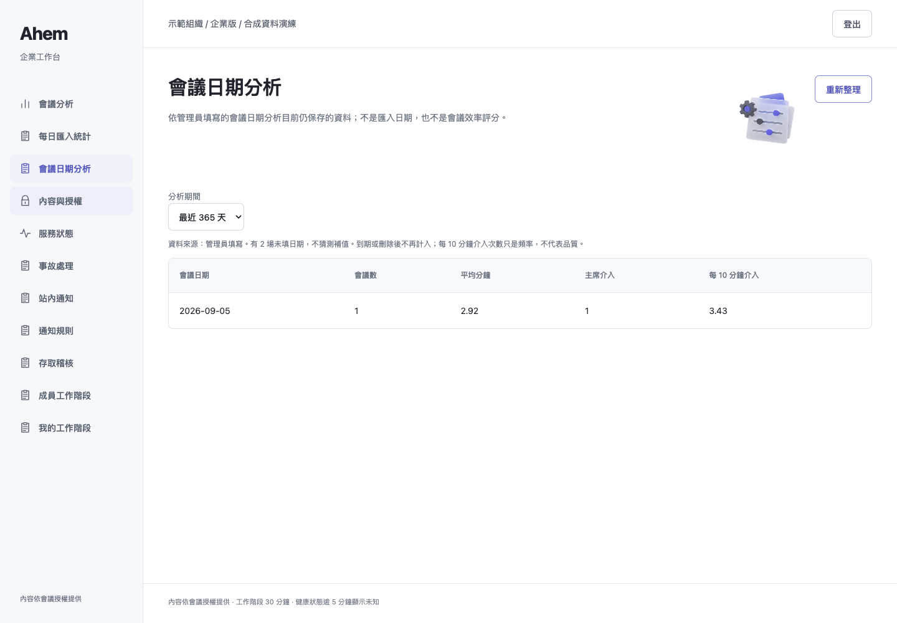
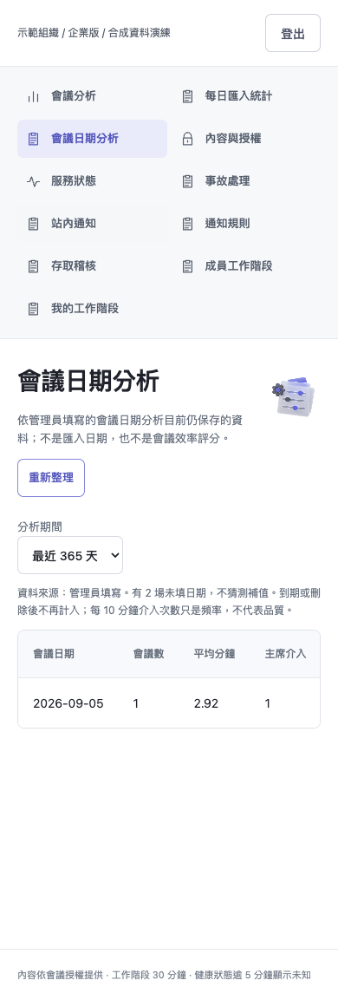

# 本機 demo 收尾：會議日期分析與備份保留管理

延續使用者確認的「不接外部服務，只完成本機 demo」。本輪新增下列功能，不將其描述成正式商用平台。

## 本輪完成

1. 管理員可在「內容與授權 → 填寫日期」記錄會議日期。受限會議仍需內容許可；跨組織、無權角色、不合法或未來日期皆拒絕。修改留下稽核。
2. 「會議日期分析」以管理員提供的日期聚合，30／90／365 天篩選，顯示會議數、平均分鐘、介入次數與每 10 分鐘介入頻率。缺日期不推測，零時長頻率顯示無法計算。
3. 本機加密備份 `maintain` 管理流程：先產生並驗證新備份，再評估過期受管備份；預設 dry-run（仍建立新備份，但不刪除）。`--apply` 才清理，最少保留 2 份。
4. 可用 `--interval >=60` 作為持續運行的本機備份 worker；本次沒有安裝開機服務或啟用對使用者既有備份的自動刪除。

## 日期分析界線

來源是管理員填寫，不是系統證明的真實發生時間。日期窗口以 UTC 今日計算。
只分析目前仍保存的會議，日期資料隨會議刪除／到期一起清除；365 天選項不代表自動保留 365 天。
介入頻率 = 介入次數 ÷ 總秒數 × 600，不是效率、績效或品質評分。沒有將姓名／逐字稿傳入分析頁。

## 備份保留界線

- 只管理直接位於指定私有 0700 目錄、名稱符合 `ahem-snapshot-<數字>-<8位十六進位>.enc` 的檔案，不遞迴、不處理其他名字、不跟隨 symlink。
- 所有候選檔先解密／驗 SQLite 與內容，任一無效就停止刪除。保留依檔案 mtime 計算，不依會議日期；修改 mtime 會改變評估結果。
- 預設保留 7 天、至少 2 份。保留份數優先，因此可能保留超過天數的檔案；不是法規保留期限強制刪除保證。
- `--apply` 的刪除不可撤回，剩餘备份不保證涵蓋被刪檔獨有的歷史狀態。執行前請先看 dry-run。
- 這是單程序／單寫入者的私有目錄工具，不支援同目錄多 worker；區間執行要保持程序運作。尚未進行長期運行／斷電測試。
- 本輪只對測試臨時目錄執行真刪除，沒有刪除使用者既有備份。

```sh
export PYTHONPATH=src
export AHEM_KEK_FILE=/absolute/private/kek
# --destination 是已存在的私有目錄，而不是單一輸出檔
python -m meeting_host.enterprise_backup maintain --source /absolute/private/enterprise.db --destination /absolute/private/backups
# 確認策略後才啟用清理／持續執行；不在本輪自動啟用
python -m meeting_host.enterprise_backup maintain --source /absolute/private/enterprise.db --destination /absolute/private/backups --retention-days 7 --keep-at-least 2 --apply --interval 3600
```

## 本次實際測試

| 檢查 | 結果 |
|---|---|
| 完整 suite | **685 passed、21 skipped、2 xfailed、0 failed，exit 0，28.03 秒** |
| 本輪日期與備份子集 | 6 passed，exit 0 |
| 六角色瀏覽器 | 全部通過；零 JS／console errors |
| 日期 UI 操作 | 填寫 → 儲存 → 日期分析 → 365 天切換，桌機／手機通過 |
| 備份實際 CLI | 建立及驗證 1 份合成備份；dry-run，deleted=0 |

環境：macOS、Python 3.13.5、Playwright + Chrome；Browser skill 未提供，依前端測試技能使用 Playwright。1440×1000、390×844，頁面非空白、標題正確、無錯誤覆蓋畫面／水平溢出。
21 skips：17 私有 holdout、4 真實 Discord opt-in；2 xfail 為既有項目。

```sh
PYTHONPATH=src:../outputs/enterprise-ui-20260905 ../ahem/.venv/bin/python -m pytest -p browser_channel -q -rs tests
python -m pytest -q tests/test_demo_completion.py tests/test_enterprise_backup.py
python scripts/verify_meeting_date_demo.py --identities PRIVATE_SYNTHETIC_IDENTITIES --url http://127.0.0.1:8898 --output SCREENSHOTS
```

browser_channel 是 repo 外指定本機 Chrome 的 adapter，無安全繞過；一般安裝 Playwright Chromium 後可直接 `python -m pytest -q -rs tests`。
證據：[pytest.log](pytest.log)、[roles.log](roles.log)、[browser.log](browser.log)、[backup-maintenance.log](backup-maintenance.log)。

## 完成／尚未啟用／範圍外

- 可展示：逐場內容授權、受限許可、稽核、限時成員、憑證輪替、統計、日期分析、通知規則、合成狀態、事故結案、加密備份與新檔還原。
- 尚未啟用：正式備份目錄的週期清理及開機常駐。管理工具已實作，但不能假稱使用者的備份已受排程保護。
- 尚未驗證：長期耐久／容量、Raspberry Pi/aarch64、真實音訊延遲與正式災難切換。
- 依使用者選擇不做：外部 SSO／MFA、Email 邀請、外部監測通知、KMS／法規保留／合規認證。
- 語意上不宣稱完成：長期績效評分或永久歷史分析；目前只有仍保存資料的描述性統計。

只上傳合成畫面、程式、驗證紀錄；不傳身分檔、憑證、KEK、備份或私有資料庫。不建立 PR、不更動 main。

## 執行截圖




