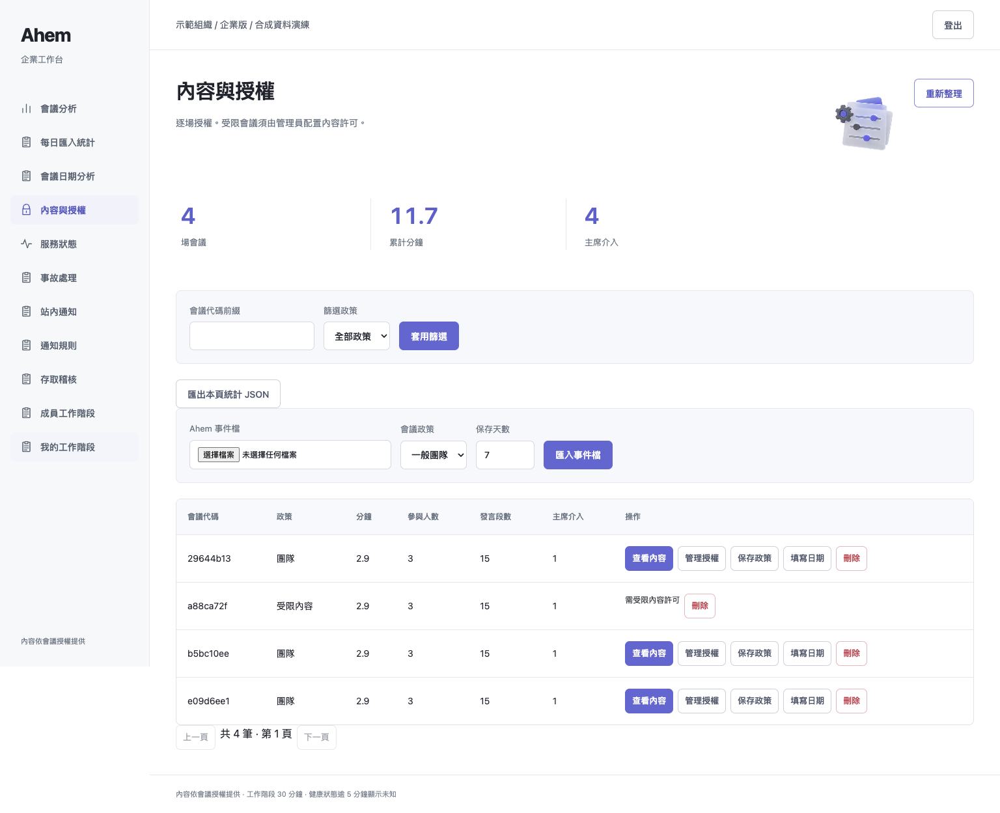
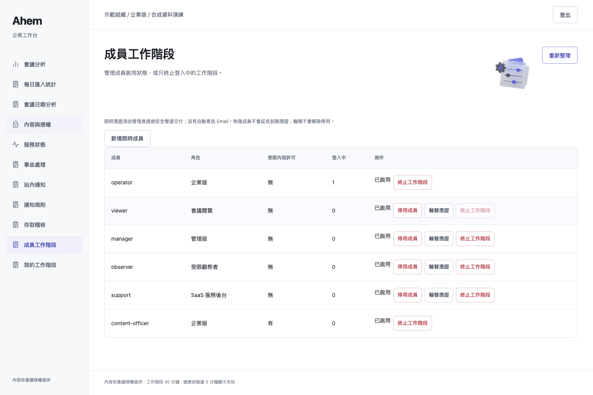
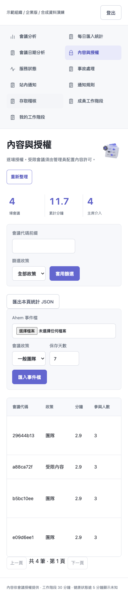

# 本機 demo 最後部署項：登入啟動與每小時備份

## 已實際啟用

- `local.ahem.enterprise-demo`：macOS 使用者 LaunchAgent，登入後啟動 loopback 8891，KeepAlive，重啟節流 30 秒。
- `local.ahem.enterprise-backup`：登入時及每小時執行一次加密備份維護；保留 7 天、至少 2 份，只管理新的私有 managed-backups 目錄。
- 憑證、KEK、實際 plist／log、DB／備份位於 repo 外私有目錄。沒有上傳這些私有檔。
- 此為登入使用者的服務，不是登入前的系統 daemon，也不是雲端服務。登出、關機或睡眠期間不能保證提供服務／準點備份。

## 本次實測（不是沿用舊結果）

| 項目 | 結果 |
|---|---|
| 完整 suite | **686 passed、21 skipped、2 xfailed、0 failed，28.51 秒，exit 0** |
| 設定檔 | 兩個 plist 經 plutil lint 通過、launchctl bootstrap 成功 |
| 服務恢復 | 受控 SIGTERM 後 PID 改變，約 0.232 秒恢復 HTTP 200 |
| 備份 | 已執行 2 次；退出碼 0；2 份備份各自 3 筆加密會議驗證通過 |
| 本機小型負載 | 3 場合成會議，analytics API 200 次請求／4 併發，200 成功、0 失敗；p50 0.580 ms、p95 1.766 ms |
| 六角色畫面 | 六角色皆 pass，page_errors=0、console_errors=0；桌機／手機實際截圖；exit 0 |

環境：macOS 26.6.2 arm64、Python 3.13.5、Playwright + Chrome；Browser skill 未提供，沿用前端測試技能的 Playwright 路徑。
21 skips 仍為 17 私有 holdout 與 4 真實 Discord opt-in；2 xfail 為既有案例。
負載數據僅為本機小資料、短時間、唯讀 API，不能外推正式容量或音訊延遲，也不是 Raspberry Pi 成績。該次量測約 0.045 秒，對環境快取和排程敏感。

證據：[pytest.log](pytest.log)、[services.json](services.json)、[benchmark.json](benchmark.json)、[browser.log](browser.log)。
首次及再次備份沒有過期檔，deleted=0；沒有刪除使用者原有備份。兩份是當下快照，不是兩個不同時間週期的長期恢復證據。

## 重現與維護

```sh
# 預覽；不寫入或載入 LaunchAgent
python scripts/install_local_demo_agents.py --runtime /absolute/private-demo
# 確認無其他程序占用8891後才安裝；拒絕覆蓋任何既有同名 job
python scripts/install_local_demo_agents.py --runtime /absolute/private-demo --install
# 以下會重啟專用 demo 並觸發備份，非唯讀檢查
PYTHONPATH=src AHEM_KEK_FILE=/absolute/private-demo/kek python scripts/verify_local_demo_agents.py --runtime /absolute/private-demo --output PRIVATE_REPORT.json
python scripts/benchmark_local_demo.py --url http://127.0.0.1:8891 --identities PRIVATE_IDENTITIES --output PRIVATE_REPORT.json
# 本次完整測試使用本機 Chrome adapter
PYTHONPATH=src:../outputs/enterprise-ui-20260905 ../ahem/.venv/bin/python -m pytest -p browser_channel -q -rs tests
# 本次瀏覽器驗證；只對合成 demo 使用，會匯入合成會議並測試授權操作
python scripts/verify_enterprise_browser.py --identities PRIVATE_IDENTITIES --url http://127.0.0.1:8891 --output SCREENSHOT_DIRECTORY --channel chrome
```

依賴目前 checkout 與 Python venv 的絕對路徑；搬移／刪除 repo 或 venv 會令服務失敗。若安裝中途出錯，先查已寫入的 job 與 log，不重複覆蓋或裝第二組。
備份採單寫入者：不要額外啟動同目錄的 `maintain --interval`；launchd 不會把同一 job 重疊啟動。
至少兩份優先於保留天數；檔案 mtime 決定到期，不是法規期限保證。清理不可撤回，仍需定期人工還原演練。

停止／回復方式（由使用者在 Terminal 執行）：

```sh
launchctl bootout gui/$(id -u)/local.ahem.enterprise-backup
launchctl bootout gui/$(id -u)/local.ahem.enterprise-demo
```

bootout 只卸載當前登入工作階段；若要持久停用，下次登入前還需將對應兩個 plist 移出 `~/Library/LaunchAgents` 保留備份。不要刪除私有 KEK、資料庫或備份。
回到手動模式可使用既有 enterprise 啟動命令。不要使用舊版忽略停用／輪替記錄的程式，否則舊憑證可能恢復。

## 範圍結論

本機 demo 目前已具備可展示的第2–5層流程，含登入角色、授權、日期統計、限時憑證／輪替、受限內容、站內通知、合成監測演練、事故處理、加密備份／還原與登入啟動。
本輪把「尚未啟用週期備份／登入啟動」改為已啟用並驗證；不是將外部／正式環境功能偷偷納入。

尚未實測：整台重開機／登出再登入、睡眠喚醒、長時間耐久、實際跑滿7天後的排程清理、斷電復原、Raspberry Pi 與真實語音壓測。
依使用者選擇不在本機 demo 範圍：外部 SSO／MFA、Email、真實監測通知、外部 KMS、法規保留／合規認證。

## 系統服務啟動後的真實畫面





